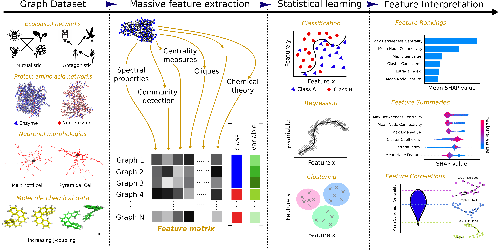

# *hcga*: Highly comparative graph analysis

This is the official repository of *hcga*, a highly comparative graph analysis toolbox. It performs a massive feature extraction from a set of graphs, and applies supervised classification methods. 

<p align="center">
  
</p>

Networks are widely used as mathematical models of complex systems across many scientific disciplines, not only in biology and medicine but also in the social sciences, physics, computing and engineering. Decades of work have produced a vast corpus of research characterising the topological, combinatorial, statistical and spectral properties of graphs. Each graph property can be thought of as a feature that captures important (and some times overlapping) characteristics of a network. In the analysis of real-world graphs, it is crucial to integrate systematically a large number of diverse graph features in order to characterise and classify networks, as well as to aid network-based scientific discovery. Here, we introduce *hcga*, a framework for highly comparative analysis of graph data sets that computes several thousands of graph features from any given network. *hcga* also offers a suite of statistical learning and data analysis tools for automated identification and selection of important and interpretable features underpinning the characterisation of graph data sets.

## Installation

For users that are not familiar with python and would like to use this code, we apologise that it isn't available in other languages. However, to help set you up with have provided a description of the steps required to setup python and its necessary dependencies if you scroll down to the bottom.

For experienced users please clone the repository, navigate to the main folder and install using:

```
pip install .
```

## Main Work Flow

1. Create a dataset
--------------------

Benchmarks datasets from `Graphkernel <https://ls11-www.cs.tu-dortmund.de/people/morris/graphkerneldatasets>`_ can be loaded directly with::

    $ hcga get_data DATASET

where for example, ``DATASET`` can be one of 
    * ENZYMES
    * DD
    * COLLAB
    * PROTEINS
    * REDDIT-MULTI-12K
    
To create custom dataset, please follow one of the [examples](https://github.com/barahona-research-group/hcga/tree/master/examples) in the `examples/` directory.
    
2. Extract features
--------------------

Once a dataset is created, features can be extracted using for example::

    $ hcga extract_features dataset.pkl --mode fast --timeout 10 --n-workers 4 

we refer to the hcga app documentation for more details, but the main options here include:

- ``--mode fast``: only extract simple features (other options include ``medium/slow`` 
- ``--timeout 10``: stop features computation after 10 seconds (this prevents some features to get stuck)
- ``--n-workers 4``: set the number of workers in multiprocessing
- ``--runtime``: this option runs a small set of graphs and ouput estimated times for each feature

3. Classifiy graphs
--------------------

Finally, to use the extracted features to classify graphs with respect to their labels, one use::

    $ hcga feature_analysis dataset --interpretability 1

where ``dataset`` is the name of the dataset, and ``--interpretability 1`` selects the features with all interpretabilities. Choices range from ``1-5``, where ``5`` only uses most interpretable features.


## Documentation

Head over to our [documentation](https://barahona-research-group.github.io/hcga/) to find out more about installation, data handling, creation of datasets and a full list of implemented features, transforms, and datasets.
For a quick start, check out our [examples](https://github.com/barahona-research-group/hcga/tree/master/examples) in the `examples/` directory.

## Contributors
*****************

- Robert Peach, GitHub: `peach-lucien <https://github.com/peach-lucien>`_
- Alexis Arnaudon, GitHub: `arnaudon <https://github.com/arnaudon>`_
- Henry Palasciano, GitHub: `henrypalasciano <https://github.com/henrypalasciano>`_
- Nathan Bernier, GitHub: `nrbernier <https://github.com/nrbernier>`_
- Julia Schmidt, Github: `misterblonde <https://github.com/misterblonde>`_

We are always on the look out for individuals that are interested in contributing to this open-source project. Even if you are just using *hcga* and made some minor updates, we would be interested in your input. 

To contribute you just need to follow some simple steps:
1. Create a github account and sign-in.
2. Fork the hcga repository to your own github account. You can do this by clicking on the upper right Fork link.
3. Clone the forked repository to your local machine e.g. ```git clone https://github.com/your_user_name/hcga.git```
4. Navigate to your local repository in the command terminal.
5. Add the original hcga repository as your upstream e.g. ```git remote add upstream https://github.com/barahona-research-group/hcga.git```
6. Pull the latest changes by typing ```git pull upstream master```
7. Create a new branch with some name by typing ```git checkout -b BRANCH_NAME```
8. Make the changes to the code that you wanted to make.
9. Commit your changes with ``` git add -A ``` 
10. Stage your changes with ``` git commit -m "DESCRIPTION OF CHANGES"```
11. Push your changes by typing ```git push origin BRANCH_NAME```
12. Go back to the forked repository on the github website and begin the pull request by clicking the green compare and pull request button. 

Thanks for anyone and everyone that chooses to contribute on this project.


## Cite

Please cite our paper if you use this code in your own work:

```
hcga: Highly Comparative Graph Analysis for network phenotyping
Robert L Peach, Alexis Arnaudon, Julia A Schmidt, Henry Palasciano, Nathan R Bernier, Kim Jelfs, Sophia Yaliraki, Mauricio Barahona
bioRxiv 2020.09.25.312926; doi: https://doi.org/10.1101/2020.09.25.312926 

```

The bibtex reference:
```
@article{peach2020hcga,
  title={hcga: Highly Comparative Graph Analysis for network phenotyping},
  author={Peach, Robert L and Arnaudon, Alexis and Schmidt, Julia A and Palasciano, Henry and Bernier, Nathan R and Jelfs, Kim and Yaliraki, Sophia and Barahona, Mauricio},
  journal={bioRxiv},
  year={2020},
  publisher={Cold Spring Harbor Laboratory}
}

```

## Run example

In the example folder, the script ``run_example.sh`` can be used to run the benchmark examples in the paper:
```
./run_example.sh DATASET
```
where ``DATASET`` is one of 
* ``ENZYMES``
* ``DD``
* ``COLLAB``
* ``PROTEINS``
* ``REDDIT-MULTI-5K``

Other examples can be found as jupyter-notebooks in `examples/` directory. We have included six examples:
* Example 1: Classification on synthetic data
* Example 2: Regression on synthetic data
* Example 3: Large Molecule dataset and regression
* Example 4: Training on labelled data, saving the fitted model, and predicting on unseen unlabelled data.
* Example 5: Pairwise classification. Exploring the similarity of classes.
* Example 6: Loading data in different ways.
* Example 7: Using different classifiers.


## Python, Anaconda and hcga installation

The simplest setup will be to install [Anaconda](https://docs.anaconda.com/anaconda/install/). Anaconda is a package manager and contains useful IDEs for writing and viewing python scripts and notebooks. Choose from one of the following links below depending on your operating system:
* [Windows users](https://docs.anaconda.com/anaconda/install/windows/). Simply download the installer and make sure to register Anaconda3 as the default Python.
* [Mac users](https://docs.anaconda.com/anaconda/install/mac-os/). Perform the standard installation.
* [Linux users](https://docs.anaconda.com/anaconda/install/linux/). Linux will often require dependencies depending on your Linux distribution - these are described in the link.

Please update to the most recent version of Python (>3.7). If you are using anaconda then type ```conda update python```.

Once Anaconda is installed can download the *hcga* project. There are two ways to do this:
1. Manually by clicking on the green Code button and downloading the zip file. Then unzip into your directory of choice.
2. If you have git then clone the code. Go to your terminal and type ``` git clone https://github.com/barahona-research-group/hcga.git ```


Once hcga is on your local machine you can open your command terminal (in any operating system), navigate into the *hcga* folder and simply type:

```
pip install .
```
If you are running on windows and receive an 'access denied' then either run your command terminal as administrator or try the command:

```
pip install --user . 
```

The hcga package should now be installed directly into your Anaconda packages alongside other dependencies. 

If you want to run the example scripts then you need to open jupyter-notebook. Alternatively, you can run the example python scripts directly from the command line (see Run Example above). Thankfully jupyter-notebook is automatically installed with Anaconda. To open jupyter-notebook open a command terminal and type:
```
jupyter-notebook
```
You can then navigate to the examples folder and open the notebook of your choosing.


## Our other available packages

If you are interested in trying our other packages, see the below list:
* [GDR](https://github.com/barahona-research-group/GDR) : Graph diffusion reclassification. A methodology for node classification using graph semi-supervised learning.
* [MSC](https://github.com/barahona-research-group/MultiscaleCentrality) : MultiScale Centrality: A scale dependent metric of node centrality.


